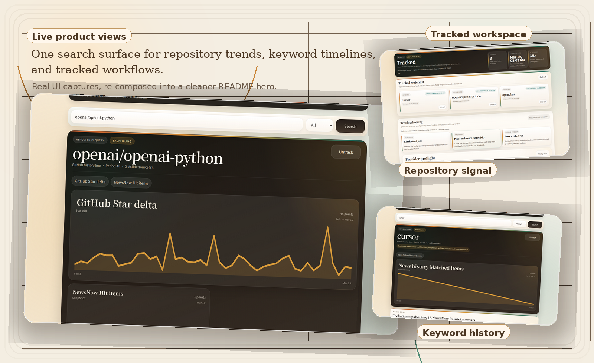
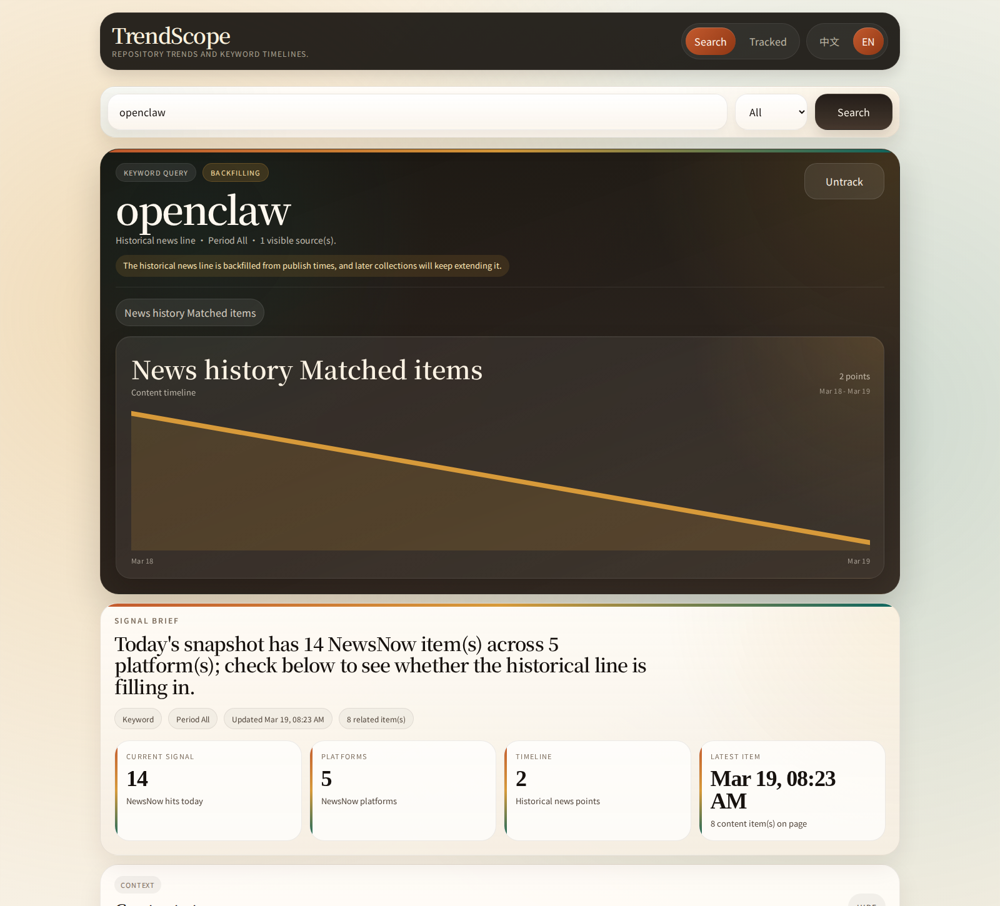

# TrendScope

English | [简体中文](./README.zh-CN.md)

TrendScope is a local-first trend analysis app for tracking GitHub repositories and open-web keywords from one place.

The current product path is `backend/`: a FastAPI application that serves the API, built-in web UI, SQLite storage, CLI, and collection workflows directly. The `frontend/` directory is a legacy Next.js prototype kept only for reference.

## Product Preview

The hero below is composed from real screenshots of the current built-in web UI.

<p align="center">
  
</p>

| Raw openclaw search | Raw tracked dashboard |
| --- | --- |
|  |  |

## Highlights

- Search a GitHub URL, `owner/repo`, a plain keyword, or a bare repo name that resolves cleanly
- Expand plain-keyword searches across Chinese and English variants, then merge and dedupe results
- Return partial results first, then backfill missing history and content asynchronously
- Keep trend lines, snapshots, content items, availability, and tracking in one built-in UI
- Run provider diagnostics, smoke checks, and manual collection from `/tracked`

## Current Product Status

- Primary runtime: `FastAPI + SQLite + built-in static web UI`
- Default local URL: `http://127.0.0.1:5081`
- Example-env starting mode: `mock`
- Core real providers: `GitHub` and `NewsNow`
- Optional archive and history enrichers: `Google News`, `Direct RSS`, and `GDELT`
- Validation workflows are available from the HTTP API, CLI, `/tracked`, and acceptance scripts

## Architecture At A Glance

```text
backend/   FastAPI app, SQLite models, provider workflows, CLI, and static web UI
frontend/  legacy Next.js prototype kept only for reference
docs/      product, technical, runtime, and acceptance documentation
scripts/   local acceptance, real-provider acceptance, and smoke helpers
```

## Quick Start

### Recommended Local Run

Requirements:

- Python `3.12+`
- `uv`

```bash
cd backend
cp .env.example .env
uv sync
PORT=5081 RELOAD=1 uv run python run_server.py
```

Open these URLs after startup:

- Search page: `http://127.0.0.1:5081/`
- Tracked page: `http://127.0.0.1:5081/tracked`
- Health check: `http://127.0.0.1:5081/api/health`

### Docker Run

Requirements:

- Docker
- Docker Compose v2

```bash
docker compose up --build
```

The compose file also exposes the app on `http://127.0.0.1:5081`.

### Alternative Start

```bash
cd backend
uv run uvicorn app.main:app --host 127.0.0.1 --port 5081 --reload
```

## Example Queries To Try

- `openai/openai-python`
- `https://github.com/vercel/next.js`
- `cursor`
- `manus`

## Provider Modes

- `PROVIDER_MODE=mock`
  - Fully offline
  - Deterministic data for local development and tests
- `PROVIDER_MODE=real`
  - Use real upstreams directly
  - Expose upstream failures instead of falling back
- `PROVIDER_MODE=auto`
  - Prefer real upstreams
  - Fall back to mock when a real request fails

Ready-made env templates:

- [`backend/.env.example`](./backend/.env.example)
- [`backend/.env.auto.example`](./backend/.env.auto.example)
- [`backend/.env.real.example`](./backend/.env.real.example)

Useful real-provider knobs:

- `NEWSNOW_SOURCE_IDS`
- `GOOGLE_NEWS_ENABLED`
- `DIRECT_RSS_ENABLED`
- `GDELT_ENABLED`
- `ARCHIVE_AMBIGUOUS_QUERY_CONTEXTS_JSON`
- `REQUEST_TIMEOUT_SECONDS`
- `HTTP_PROXY`

Provider runtime guide:

- [`docs/provider-runtime.md`](./docs/provider-runtime.md)

`ARCHIVE_AMBIGUOUS_QUERY_CONTEXTS_JSON` lets you constrain ambiguous keywords with extra context. Example:

```json
{
  "manus": ["ai", "agent", "agents"],
  "claude": ["anthropic", "code", "ai"]
}
```

## Common Commands

### Tests

```bash
cd backend
uv run python -m unittest discover -s tests -v
```

### CLI

```bash
cd backend
uv run python -m app.cli health
uv run python -m app.cli search openai/openai-python --period 30d
uv run python -m app.cli track openai/openai-python
uv run python -m app.cli list-tracked
uv run python -m app.cli scheduler-status
uv run python -m app.cli provider-status
uv run python -m app.cli provider-verify --probe-mode real
uv run python -m app.cli provider-smoke openai/openai-python --period 30d --probe-mode real
uv run python -m app.cli collect-tracked --period 30d
```

### API Examples

```bash
curl 'http://127.0.0.1:5081/api/health'
curl 'http://127.0.0.1:5081/api/search?q=openai/openai-python&period=30d'
curl 'http://127.0.0.1:5081/api/search?q=oil&period=30d&content_source=google_news'
curl 'http://127.0.0.1:5081/api/keywords?tracked_only=true'
curl 'http://127.0.0.1:5081/api/collect/status'
curl 'http://127.0.0.1:5081/api/collect/logs?limit=20'
```

`content_source` currently supports:

- `all`
- `github`
- `newsnow`
- `google_news`
- `direct_rss`
- `gdelt`

## Acceptance Workflows

### Local Acceptance

```bash
backend/.venv/bin/python scripts/local_acceptance.py --skip-ui
TRENDSCOPE_UI_DRIVER=inprocess backend/.venv/bin/python scripts/local_acceptance.py
backend/.venv/bin/python scripts/local_acceptance.py --ui-python /path/to/python-with-playwright
backend/.venv/bin/python scripts/local_acceptance.py --skip-ui --json
```

This script can:

- run backend unit tests
- check or auto-start the FastAPI server
- execute UI smoke checks
- emit machine-readable JSON output

### Real-Provider Acceptance

One-command workflow:

```bash
backend/.venv/bin/python scripts/run_real_provider_acceptance.py --mode auto
backend/.venv/bin/python scripts/run_real_provider_acceptance.py --mode auto --run-ui --ui-python /path/to/python-with-playwright
```

Manual record workflow:

```bash
backend/.venv/bin/python scripts/init_real_provider_acceptance_record.py --mode auto
backend/.venv/bin/python scripts/update_real_provider_acceptance_record.py --mode auto
backend/.venv/bin/python scripts/update_real_provider_acceptance_record.py --mode auto --run-ui --ui-python /path/to/python-with-playwright
```

In `real` mode, the record updater also runs isolated temporary probes to verify:

- empty-database startup
- scheduler-driven tracked collection
- readable failure states for `search`, `backfill`, and `collect`

Related docs:

- [`docs/local-acceptance.md`](./docs/local-acceptance.md)
- [`docs/real-provider-acceptance.md`](./docs/real-provider-acceptance.md)
- [`docs/real-provider-acceptance-record-template.md`](./docs/real-provider-acceptance-record-template.md)
- [`docs/acceptance-records/`](./docs/acceptance-records)

## API Surface

- `GET /api/health`
- `GET /api/search?q=<query>&period=<7d|30d|90d|all>&content_source=<...>`
- `GET /api/keywords/{id}/backfill-status`
- `GET /api/keywords`
- `POST /api/keywords`
- `POST /api/keywords/{id}/track`
- `DELETE /api/keywords/{id}/track`
- `POST /api/collect/trigger`
- `GET /api/collect/status`
- `GET /api/collect/logs`
- `GET /api/provider-status`
- `POST /api/provider-verify`
- `POST /api/provider-smoke`

## Key Docs

- [`CONTRIBUTING.md`](./CONTRIBUTING.md)
- [`docs/README.md`](./docs/README.md)
- [`docs/product-prd.md`](./docs/product-prd.md)
- [`docs/technical-spec.md`](./docs/technical-spec.md)
- [`docs/current-functional-flow.md`](./docs/current-functional-flow.md)
- [`docs/docker-deployment.md`](./docs/docker-deployment.md)
- [`docs/mvp-completion-checklist.md`](./docs/mvp-completion-checklist.md)

## License

The repository code is licensed under [`Apache-2.0`](./LICENSE).

That license covers this repository's code and bundled documentation. It does not change the terms of third-party data sources or trademarks such as GitHub, NewsNow, Google News, Direct RSS feeds, or GDELT.
