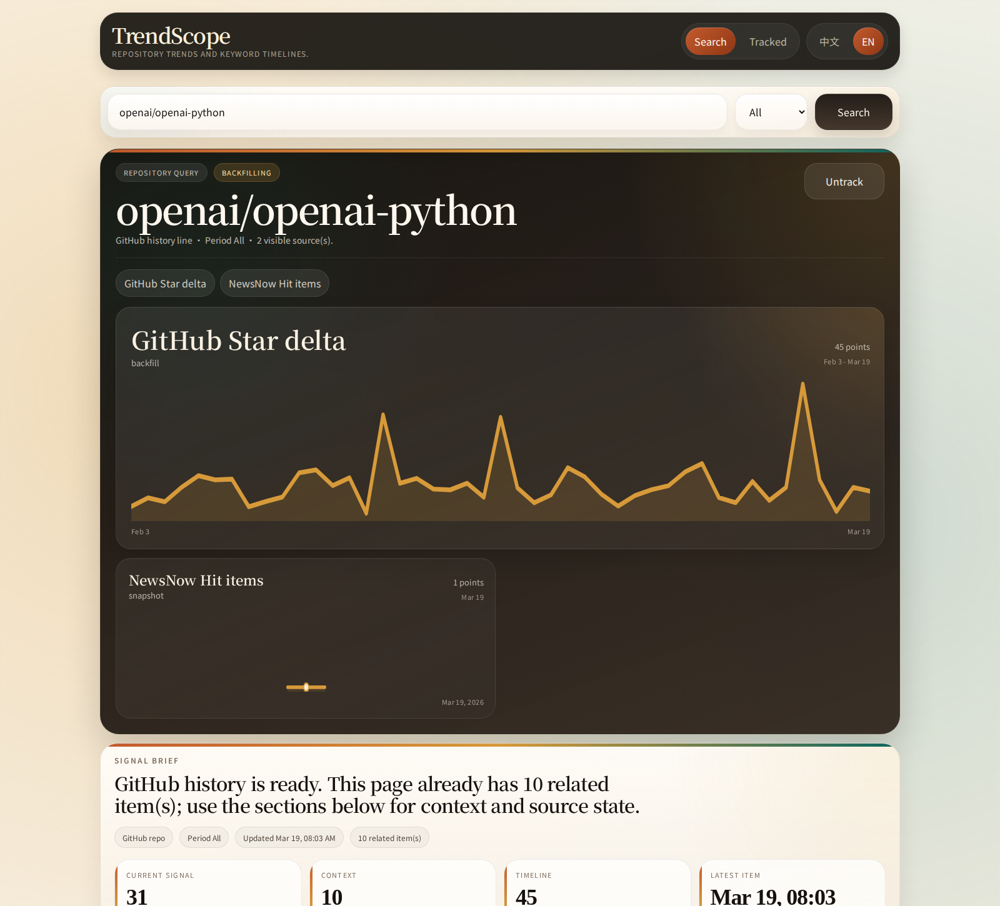
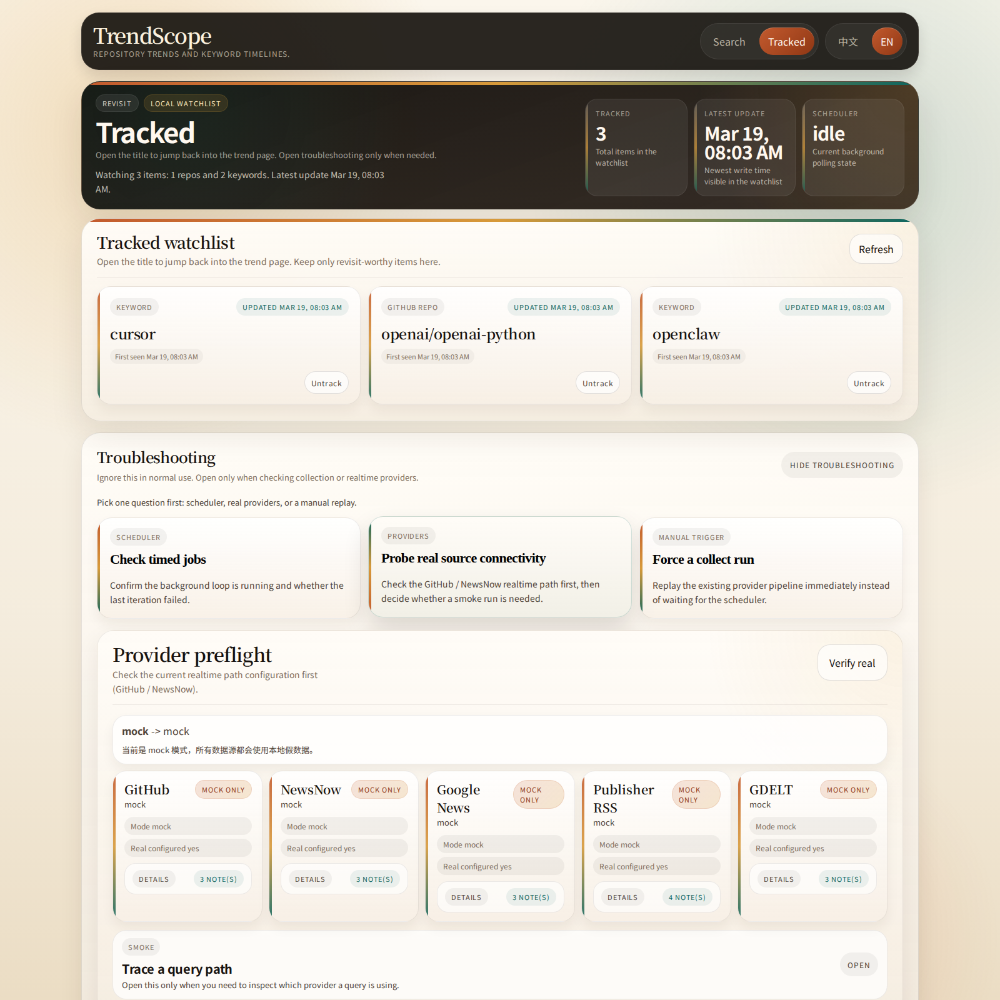

# TrendScope

[English](./README.md) | 简体中文

TrendScope 是一个本地优先的趋势分析应用，用来在一个地方同时跟踪 GitHub 仓库和开放网络关键词的热度变化。

当前主产品路径是 `backend/`：它是一个直接提供 API、内置网页界面、SQLite 存储、CLI 和采集流程的 FastAPI 应用。`frontend/` 目录只是保留的历史 Next.js 原型，不是当前运行入口。

## 产品预览

下面这些都是当前内置 Web UI 的真实截图，不是示意图。

<p align="center">
  
</p>

| 关键词搜索 | 追踪面板 |
| --- | --- |
|  |  |

## 亮点

- 支持搜索 GitHub URL、`owner/repo`、普通关键词，以及能稳定解析的裸仓库名
- 普通关键词会同时尝试中英文变体搜索，再合并去重
- 首包先返回当前已有结果，缺失的历史和内容异步回填
- 在一个内置界面里同时展示趋势线、快照、内容流、可用性状态和追踪能力
- 可在 `/tracked` 页面管理追踪项，并执行 provider 诊断、smoke 检查和手动采集

## 当前产品状态

- 主运行形态：`FastAPI + SQLite + 内置静态 Web UI`
- 默认本地地址：`http://127.0.0.1:5081`
- 示例环境起始模式：`mock`
- 核心真实源：`GitHub` 和 `NewsNow`
- 可选补充历史源：`Google News`、`Direct RSS`、`GDELT`
- HTTP API、CLI、`/tracked` 页面和验收脚本都可用于验证当前行为

## 架构一览

```text
backend/   FastAPI 应用、SQLite 模型、provider 流程、CLI 和静态 Web UI
frontend/  仅保留作参考的历史 Next.js 原型
docs/      产品、技术、运行和验收文档
scripts/   本地验收、真实源验收和 smoke 辅助脚本
```

## 快速开始

### 推荐本地启动

前置要求：

- Python `3.12+`
- `uv`

```bash
cd backend
cp .env.example .env
uv sync
PORT=5081 RELOAD=1 uv run python run_server.py
```

启动后可访问：

- 搜索页：`http://127.0.0.1:5081/`
- 追踪页：`http://127.0.0.1:5081/tracked`
- 健康检查：`http://127.0.0.1:5081/api/health`

### Docker 启动

前置要求：

- Docker
- Docker Compose v2

```bash
docker compose up --build
```

`docker-compose.yml` 也会把应用暴露在 `http://127.0.0.1:5081`。

### 替代启动方式

```bash
cd backend
uv run uvicorn app.main:app --host 127.0.0.1 --port 5081 --reload
```

## 可直接尝试的查询

- `openai/openai-python`
- `https://github.com/vercel/next.js`
- `cursor`
- `manus`

## Provider 模式

- `PROVIDER_MODE=mock`
  - 完全离线
  - 适合本地开发和测试的确定性假数据
- `PROVIDER_MODE=real`
  - 直接使用真实上游
  - 不回退，直接暴露真实错误
- `PROVIDER_MODE=auto`
  - 优先走真实上游
  - 真实请求失败时回退到 mock

现成的环境模板：

- [`backend/.env.example`](./backend/.env.example)
- [`backend/.env.auto.example`](./backend/.env.auto.example)
- [`backend/.env.real.example`](./backend/.env.real.example)

常用真实源配置：

- `NEWSNOW_SOURCE_IDS`
- `GOOGLE_NEWS_ENABLED`
- `DIRECT_RSS_ENABLED`
- `GDELT_ENABLED`
- `ARCHIVE_AMBIGUOUS_QUERY_CONTEXTS_JSON`
- `REQUEST_TIMEOUT_SECONDS`
- `HTTP_PROXY`

运行说明：

- [`docs/provider-runtime.md`](./docs/provider-runtime.md)

`ARCHIVE_AMBIGUOUS_QUERY_CONTEXTS_JSON` 可用于给歧义词增加上下文约束，例如：

```json
{
  "manus": ["ai", "agent", "agents"],
  "claude": ["anthropic", "code", "ai"]
}
```

## 常用命令

### 测试

```bash
cd backend
uv run python -m unittest discover -s tests -v
```

### CLI

```bash
cd backend
uv run python -m app.cli health
uv run python -m app.cli search openai/openai-python --period 30d
uv run python -m app.cli track openai/openai-python
uv run python -m app.cli list-tracked
uv run python -m app.cli scheduler-status
uv run python -m app.cli provider-status
uv run python -m app.cli provider-verify --probe-mode real
uv run python -m app.cli provider-smoke openai/openai-python --period 30d --probe-mode real
uv run python -m app.cli collect-tracked --period 30d
```

### API 示例

```bash
curl 'http://127.0.0.1:5081/api/health'
curl 'http://127.0.0.1:5081/api/search?q=openai/openai-python&period=30d'
curl 'http://127.0.0.1:5081/api/search?q=oil&period=30d&content_source=google_news'
curl 'http://127.0.0.1:5081/api/keywords?tracked_only=true'
curl 'http://127.0.0.1:5081/api/collect/status'
curl 'http://127.0.0.1:5081/api/collect/logs?limit=20'
```

当前 `content_source` 支持：

- `all`
- `github`
- `newsnow`
- `google_news`
- `direct_rss`
- `gdelt`

## 验收流程

### 本地验收

```bash
backend/.venv/bin/python scripts/local_acceptance.py --skip-ui
TRENDSCOPE_UI_DRIVER=inprocess backend/.venv/bin/python scripts/local_acceptance.py
backend/.venv/bin/python scripts/local_acceptance.py --ui-python /path/to/python-with-playwright
backend/.venv/bin/python scripts/local_acceptance.py --skip-ui --json
```

该脚本可以：

- 运行后端单测
- 检查或自动拉起 FastAPI 服务
- 执行 UI smoke 检查
- 输出机器可读 JSON 结果

### 真实 Provider 验收

一键流程：

```bash
backend/.venv/bin/python scripts/run_real_provider_acceptance.py --mode auto
backend/.venv/bin/python scripts/run_real_provider_acceptance.py --mode auto --run-ui --ui-python /path/to/python-with-playwright
```

手动记录流程：

```bash
backend/.venv/bin/python scripts/init_real_provider_acceptance_record.py --mode auto
backend/.venv/bin/python scripts/update_real_provider_acceptance_record.py --mode auto
backend/.venv/bin/python scripts/update_real_provider_acceptance_record.py --mode auto --run-ui --ui-python /path/to/python-with-playwright
```

在 `real` 模式下，验收记录更新脚本还会额外运行隔离临时 probe，自动验证：

- 空库启动
- scheduler 驱动的 tracked 采集
- `search`、`backfill`、`collect` 的可读失败态

相关文档：

- [`docs/local-acceptance.md`](./docs/local-acceptance.md)
- [`docs/real-provider-acceptance.md`](./docs/real-provider-acceptance.md)
- [`docs/real-provider-acceptance-record-template.md`](./docs/real-provider-acceptance-record-template.md)
- [`docs/acceptance-records/`](./docs/acceptance-records)

## API 一览

- `GET /api/health`
- `GET /api/search?q=<query>&period=<7d|30d|90d|all>&content_source=<...>`
- `GET /api/keywords/{id}/backfill-status`
- `GET /api/keywords`
- `POST /api/keywords`
- `POST /api/keywords/{id}/track`
- `DELETE /api/keywords/{id}/track`
- `POST /api/collect/trigger`
- `GET /api/collect/status`
- `GET /api/collect/logs`
- `GET /api/provider-status`
- `POST /api/provider-verify`
- `POST /api/provider-smoke`

## 关键文档

- [`CONTRIBUTING.md`](./CONTRIBUTING.md)
- [`docs/README.md`](./docs/README.md)
- [`docs/product-prd.md`](./docs/product-prd.md)
- [`docs/technical-spec.md`](./docs/technical-spec.md)
- [`docs/current-functional-flow.md`](./docs/current-functional-flow.md)
- [`docs/docker-deployment.md`](./docs/docker-deployment.md)
- [`docs/mvp-completion-checklist.md`](./docs/mvp-completion-checklist.md)

## 许可证

仓库代码采用 [`Apache-2.0`](./LICENSE) 许可证。

这个许可证覆盖本仓库中的代码和随仓库分发的文档；它不会改变 GitHub、NewsNow、Google News、Direct RSS 或 GDELT 等第三方数据源和商标本身的使用条款。
